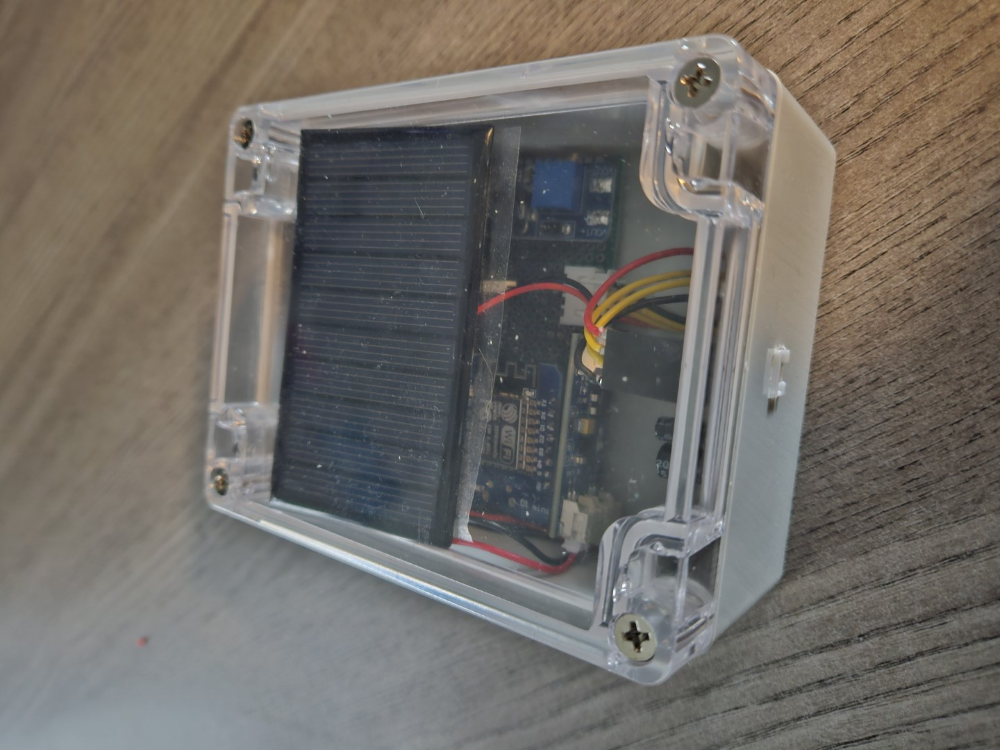
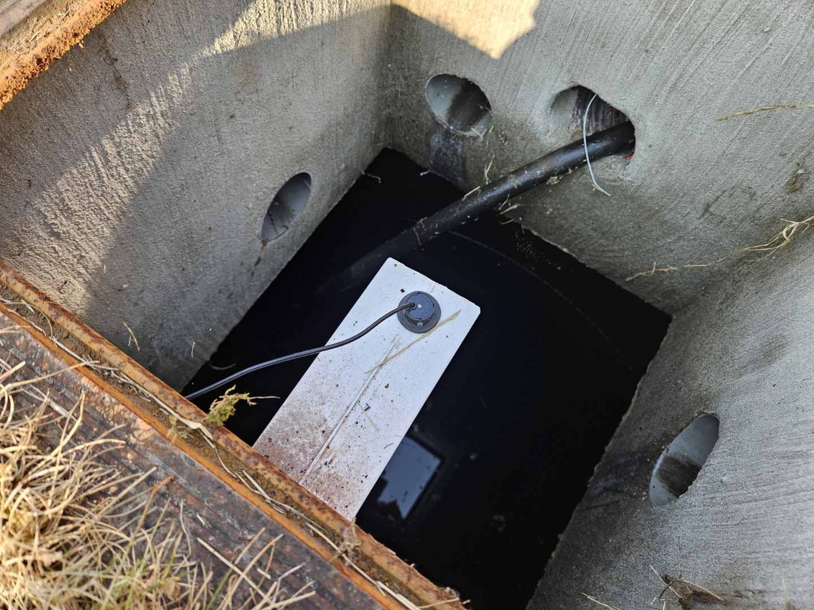
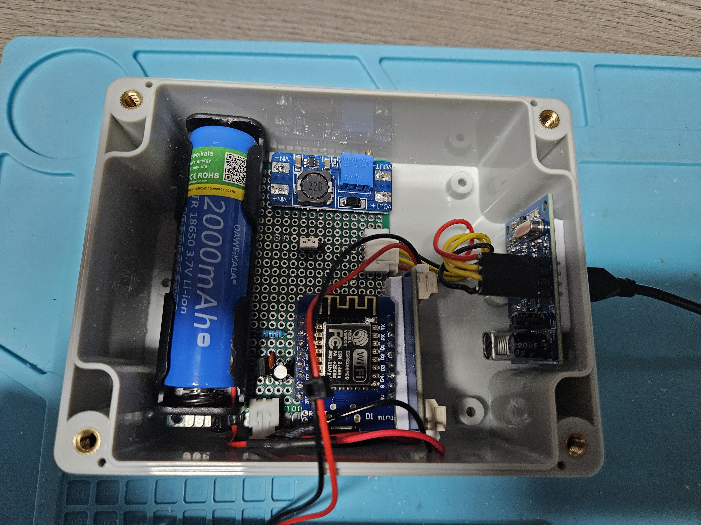
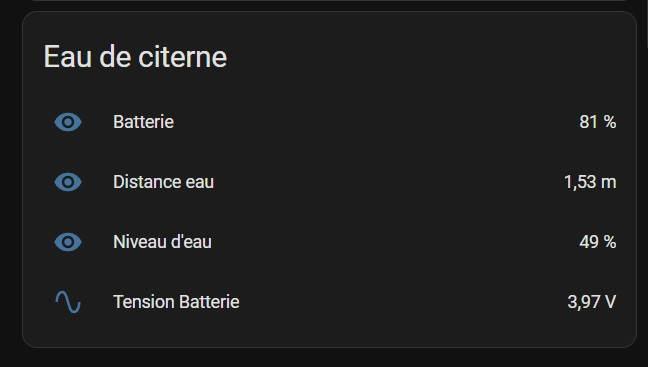

# 💧 Capteur de Niveau d'Eau – Wemos D1 + ESPHome

Ce projet utilise un microcontrôleur Wemos D1 Mini avec ESPHome pour mesurer le niveau d'eau dans une cuve à l'aide d'un capteur à ultrasons, puis publier les données via MQTT vers Home Assistant.

  
  

---

## 🧠 Objectif

L'objectif est de :  
- mesurer la distance entre le capteur et le niveau d’eau dans une cuve,  
- calculer le pourcentage de remplissage,  
- estimer l’état de la batterie,  
- envoyer toutes ces données vers un serveur MQTT,  
- économiser l’énergie grâce au mode **deep sleep** (une mesure toutes les 15 minutes).

  

---

## 🔧 Matériel utilisé

| Composant                         | Description                                                                    |
|----------------------------------|--------------------------------------------------------------------------------|
| 🧠 Wemos D1 Mini                 | Microcontrôleur basé sur ESP8266                                              |
| 🌊 Capteur AJ-SR04M              | Capteur à ultrasons étanche pour mesurer la distance d'eau dans la cuve       |
| 🔋 Module batterie Li-ion (18650) | Batterie rechargeable 3,7 V                                                    |
| ☀️ Panneau solaire               | Mini panneau solaire Mono 80×45 mm, 5 V, 60 mA                               |
| ⚡ Contrôleur de charge solaire CN3065 | Pour réguler la charge de la batterie                                       |
| ⚡ MCP1700-3302E + condensateurs | Régulateur 3,3 V + condensateurs céramiques pour alimentation du Wemos       |
| ⚡ MT3608                        | Convertisseur boost pour élever la tension à 5 V pour le capteur AJ-SR04M      |
| 🔌 Résistances / diviseur        | Pour mesurer la tension batterie via la broche A0                             |
| 🧰 Fils + breadboard             | Pour câbler les composants (à souder ou sur breadboard)                        |
| 🛠️ Logiciel                     | ESPHome, Home Assistant, broker MQTT                                          |

---

## 📡 Fonctionnement

À chaque cycle de mesure :  
1. Le Wi-Fi est activé.  
2. La connexion MQTT est établie.  
3. Le capteur ultrason est alimenté.  
4. Une mesure de distance et une mesure de batterie sont prises.  
5. Les données sont envoyées dans Home Assistant via MQTT Broker.
   
7. Le microcontrôleur entre en **sommeil profond** pour économiser la batterie.  

---

## 🗂 Structure du dépôt

- `water_level_sensor.yaml` : fichier de configuration principal ESPHome.  
- `secrets.yaml` : informations à configurer (Wi-Fi, MQTT).  

---

## 🔒 Sécurité

Les identifiants Wi-Fi, mots de passe MQTT et adresses IP sont stockés dans `secrets.yaml` pour éviter leur diffusion dans le dépôt public, conformément aux bonnes pratiques.

---

## 📦 Exemple MQTT

Les données sont publiées sur des topics tels que :  
- `water_level_sensor/status`  
- `water_level_sensor/distance`  
- `water_level_sensor/percentage`  
- `water_level_sensor/battery`

---

## 📝 Licence

Ce projet est distribué sous licence **GPLv3** – voir le fichier `LICENSE`.

---

## ⚙️ Installation & utilisation (optionnel)

1. Cloner le dépôt.  
2. Créer un fichier `secrets.yaml` contenant vos informations Wi-Fi et MQTT.  
3. Flasher votre Wemos D1 Mini avec ESPHome en utilisant le fichier `water_level_sensor.yaml`.  
4. Surveiller les données dans Home Assistant via MQTT.

---

## 🔐 Exemple minimal `secrets.yaml`

```yaml
wifi_ssid: "Votre_SSID"
wifi_password: "Votre_MotDePasse"
mqtt_broker: "192.168.x.x"
mqtt_username: "mqtt_user"
mqtt_password: "mqtt_pass"
